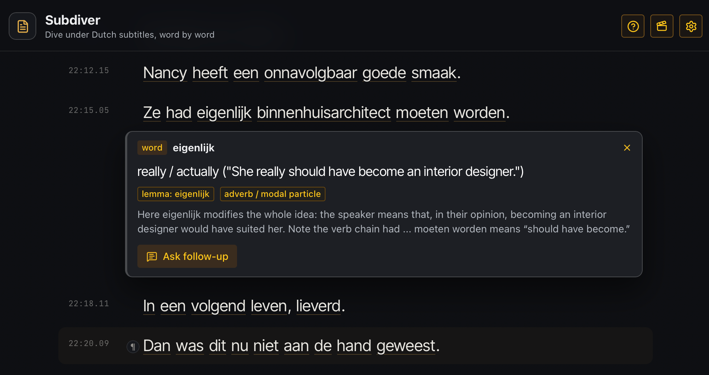

# Subdiver



> Live demo: <https://perzzev.github.io/Subdiver/>

Subdiver is a free, open-source subtitle study tool for learning Dutch by watching series.
It turns VTT/SRT subtitles into a readable timed transcript, lets you click any word for an
instant contextual translation, hold **Alt** to translate whole sentences, and remembers a
persistent chat thread per episode so you can review the questions you asked later.

> **Free for educational purposes.** Released under the MIT license. Made for language
> learners — there is no signup, no telemetry, and no server. The app runs entirely in your
> browser and talks to the OpenAI API directly using your own key.

## What it does

- **Bundled catalog** of Zuidas season 1 (Dutch business drama) so the app works out of the
  box on GitHub Pages.
- **Upload your own** `.vtt` or `.srt` subtitles — useful for any Dutch series you're
  studying.
- **Click any word** for a contextual translation. The model sees the cue around the word,
  not just the word in isolation.
- **Hold Alt (Option on Mac)** to switch into sentence mode: hovering highlights the whole
  sentence, clicking translates it with brief grammar notes. There is also a small `¶`
  marker next to each sentence for users who prefer a button.
- **Episode chat thread** — persistent in your browser per episode. Every follow-up you ask
  is stored so you can come back to an episode and review all the words and constructions
  that puzzled you.
- **Three visual themes**: Reader (Kindle-like serif), Cinema (dark with amber accents),
  Warm desk (notebook beige). Switch from the topbar.
- **Resume reading** — Subdiver remembers your position per transcript. The home screen
  shows "Continue" with progress for the last opened episode.
- **Caches translations** so repeat lookups are free.

## Privacy & data

Everything stays in your browser:

- API key and settings in `localStorage` (only if you tick "Store API key in localStorage").
- All transcripts you have opened in IndexedDB.
- Lookup cache in IndexedDB.
- Episode chat history in IndexedDB.
- Reader progress per transcript in `localStorage`.

OpenAI requests are sent directly from your browser to `api.openai.com`. There is no
intermediate server — the source of this repo is the entire stack.

## Requirements

- Node.js 24+
- npm
- An OpenAI API key (any text-capable model)

## Run locally

```bash
npm install
npm run dev
```

Open the printed local URL, usually:

```text
http://127.0.0.1:5173/
```

## First-time setup

1. Pick the visual theme you prefer from the icon in the topbar.
2. Open Settings (gear icon). Paste your OpenAI API key. If you have not created one before,
   this walkthrough is a useful reference: <https://www.youtube.com/watch?v=SzPE_AE0eEo>
3. Click **Load models** to fetch text-capable models on your account, then choose one.
   `gpt-4.1-mini` is a good default.
4. Set the target language for translations (default: Russian).
5. Pick a bundled Zuidas episode, or drop in your own VTT/SRT.
6. Click a word to translate it; hold Alt to translate the surrounding sentence.
7. Press **Ask follow-up** in any translation to open the per-episode chat thread.

## Build & deploy

```bash
npm run build
```

Preview the production build:

```bash
npm run preview
```

The Vite config sets the production base path from `GITHUB_REPOSITORY`, so the included
GitHub Actions workflow deploys the app under a repository subpath automatically.

## Tests

```bash
npm test
```

## Sample content notice

Subdiver's app code is MIT-licensed. The bundled Zuidas subtitle files are included as
educational fixtures for testing and language learning. Those subtitle samples remain owned
by their respective rights holders and are **not** covered by the MIT license for the app
code. If you are a rights holder and want a sample removed, open an issue.

## Caveat

This app is meant to run as its own page. It is not injected into NPO or other video
websites. Direct OpenAI API requests work from the app page; running the same code inside
another website can fail because that site may set a Content Security Policy that blocks
requests to `api.openai.com`.
