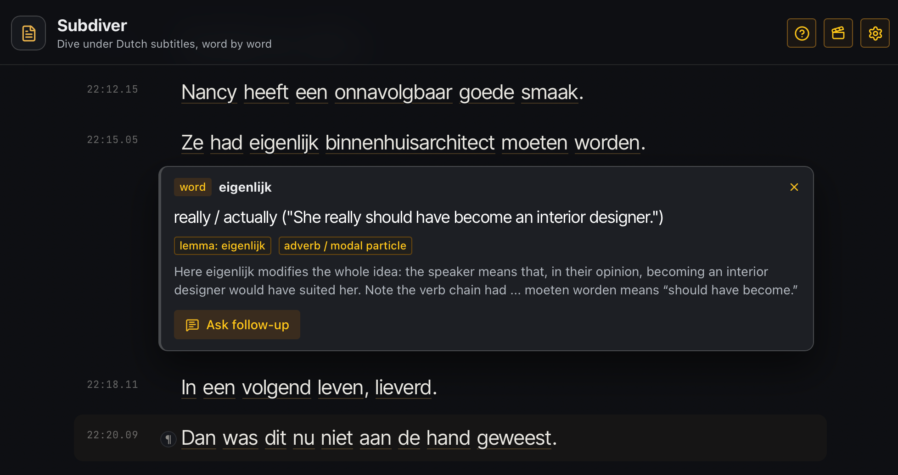

# Subdiver



> Live demo: <https://perzzev.github.io/Subdiver/>

Subdiver is a free, open-source reading tool for learning Dutch with books and series.
It turns EPUB books into readable chapters and VTT/SRT subtitles into a timed transcript, letting you click any word for an
instant contextual translation, hold **Alt** to translate whole sentences, and remembers a
persistent chat thread per book or episode so you can review the questions you asked later.

> **Free for educational purposes.** Released under the MIT license. Made for language
> learners — there is no signup, no telemetry, and no server. The app runs entirely in your
> browser and talks to the OpenAI API directly using your own key.

## What it does

- **Bundled catalog** of Zuidas season 1 (Dutch business drama) so the app works out of the
  box on GitHub Pages.
- **Upload your own** `.epub` books or `.vtt` / `.srt` subtitles by choosing a file or dragging it onto the library.
- **Read EPUB books** with chapter navigation, short reading sections, and the same word, phrase,
  and sentence lookups as subtitles. Books appear in your saved library with their title and author.
  Reopening the same EPUB, even with a different filename, retains its progress and chat.
  Supports DRM-free EPUB 2 and 3 books up to 30 MB. This is a text reader: images, publisher
  styling, and interactive content are omitted; image-only books are not supported.
- **Click any word** for a contextual translation. The model sees the passage around the word,
  not just the word in isolation.
- **Hold Alt (Option on Mac)** to switch into sentence mode: hovering highlights the whole
  sentence, clicking translates it with brief grammar notes. There is also a small `¶`
  marker next to each sentence for users who prefer a button.
- **Reading chat thread** — persistent in your browser per book or episode. Every follow-up you ask
  is stored so you can come back to an episode and review all the words and constructions
  that puzzled you.
- **Three visual themes**: Reader (Kindle-like serif), Cinema (dark with amber accents),
  Warm desk (notebook beige). Switch from the topbar.
- **Resume reading** — Subdiver remembers your position per transcript. The home screen
  shows "Continue" with progress for the last opened episode.
- **Caches translations by passage and lookup mode** so repeat lookups are free while different contexts get their own meanings.

## Privacy & data

Everything stays in your browser:

- API key and settings in `localStorage` (only if you tick "Store API key in localStorage").
- All imported book text and transcripts you have opened in IndexedDB.
- Lookup cache in IndexedDB.
- Episode chat history in IndexedDB.
- Reader progress per transcript in `localStorage`.

Importing a book does not send it to a server. When you request a translation, the selected text
and its surrounding passage are sent to OpenAI; chat follow-ups also include the reading chat.

OpenAI requests are sent directly from your browser to `api.openai.com`. There is no
intermediate server — the source of this repo is the entire stack.

## Requirements

- Node.js 24+
- npm
- An OpenAI API key (any text-capable model)

## Run locally

```bash
npm install
npm run dev
```

Open the printed local URL, usually:

```text
http://127.0.0.1:5173/
```

## First-time setup

1. Pick the visual theme you prefer from the icon in the topbar.
2. Open Settings (gear icon). Paste your OpenAI API key. If you have not created one before,
   this walkthrough is a useful reference: <https://www.youtube.com/watch?v=SzPE_AE0eEo>
3. Click **Load models** to fetch text-capable models on your account, then choose one.
   `gpt-4.1-mini` is a good default.
   The old `gpt-5.5` default is migrated once to `gpt-4.1-mini`; other saved model
   choices are preserved. You can choose `gpt-5.5` again afterwards.
4. Set the target language for translations (default: Russian).
5. Pick a bundled Zuidas episode, or drop in your own EPUB/VTT/SRT. For books, choose a chapter from the chapter menu.
6. Click a word to translate it; hold Alt to translate the surrounding sentence.
7. Press **Ask follow-up** in any translation to open the chat thread for that book or episode.

## Translation speed and reliability

Lookups use the Responses API with a strict JSON schema, so the output format is
enforced by the API. Refusals, failed generations and incomplete responses get
specific errors. A response truncated by the token limit is retried once with
a larger budget; other errors are not automatically retried. Each HTTP request
has a 30-second timeout. The teacher instructions and contextual translation
guidance are preserved.

For clicked words, the teacher also gives a brief breakdown of meaningful
compound parts, roots or affixes when this helps explain and remember the word.
Parts are glossed in the target language, optionally with English glosses.
The guidance avoids invented etymology and forced splits, and keeps the memory
aid inside the existing explanation. Saved default instructions are upgraded
automatically; personal instructions are preserved and still receive this rule
for word lookups. The cache version changes so old answers are refreshed.

A new word, phrase or sentence cancels the previous lookup and clears the browser
selection. Late responses, errors and cache reads cannot overwrite the current
card. Closing the card, navigating away or changing translation settings also
cancels the lookup. Successful answers show their end-to-end duration; cached
answers are marked separately.

Translations stay in a fixed side panel on screens at least 1100 pixels wide,
and a compact bottom panel on smaller screens. The panel scrolls internally for
long answers and never inserts space between paragraphs. A permanent reading
gutter leaves room to scroll the last paragraph above the bottom panel. The
selected passage is highlighted, and reading chat uses the same side space on
wide screens. Neither loading, changing nor closing a translation moves the text.

Settings includes **Compare speed**: it translates a word and a sentence in the
same Dutch passage with each of four models, sequentially and without the cache.
It uses your API key and makes 8 billed requests (a token-limit retry can add a
request). Results show timing, translations and explanations, so you can judge
quality yourself. A single run is a sample, not a statistically reliable benchmark.
Model availability depends on your account; unavailable models show their API error.

For a reproducible live comparison using the application's actual lookup code
and an API key supplied by Infisical (Node.js 24+):

```bash
infisical run --env=dev -- npm run benchmark:lookups
```

The default run makes 48 billed requests: six Dutch examples, four models, two
rounds, in rotating sequential order. Set `BENCHMARK_REASONING_BASELINE=1` to add
four GPT-5.5 requests at medium reasoning. `BENCHMARK_ROUNDS`, `BENCHMARK_MODELS`
(comma-separated preset model IDs), `BENCHMARK_CASES` (comma-separated case IDs),
and `BENCHMARK_OUTPUT` can limit or separate runs. Results are saved to
`test-results/lookup-benchmark.json`, including translations, latency and token
usage, without API keys or headers. This is a small sample, not a guarantee of
latency or quality. GPT-4.1 nano made contextual translation errors in our live
sample; GPT-4.1 mini remains the default.
See the [October 7 live benchmark report](reports/lookup-benchmark-2026-10-07.md)
for measured timings, token costs and translation-quality observations.

Standard prices in USD per million tokens, checked October 7, 2026:

| Model | Input | Output |
| --- | ---: | ---: |
| [GPT-4.1 mini](https://developers.openai.com/api/docs/models/gpt-4.1-mini) (default) | $0.40 | $1.60 |
| [GPT-4o mini](https://developers.openai.com/api/docs/models/gpt-4o-mini) | $0.15 | $0.60 |
| [GPT-4.1 nano](https://developers.openai.com/api/docs/models/gpt-4.1-nano) | $0.10 | $0.40 |
| [GPT-5.5](https://developers.openai.com/api/docs/models/gpt-5.5) (previous default) | $5.00 | $30.00 |

GPT-4 models do not have a reasoning step. For GPT-5.4 (including mini/nano) and
GPT-5.5, lookups and follow-ups explicitly use `reasoning.effort: none`. Other
custom models retain their own default reasoning settings. Custom models must
support the Responses API and Structured Outputs for lookups; there is no silent
fallback to a different model or a weaker output format. See the official
[Structured Outputs guide](https://developers.openai.com/api/docs/guides/structured-outputs).

## Build & deploy

```bash
npm run build
```

Preview the production build:

```bash
npm run preview
```

The Vite config sets the production base path from `GITHUB_REPOSITORY`, so the included
GitHub Actions workflow deploys the app under a repository subpath automatically.

## Tests

```bash
npm test
```

Browser interaction checks (using mocked translation responses):

```bash
npx playwright install chromium
npm run test:e2e
```

To also check a local EPUB, set `EPUB_SAMPLE` to its absolute path when running the browser tests.
Use `PLAYWRIGHT_CHROMIUM_CHANNEL=chrome` to run them in an installed Chrome browser.

## Sample content notice

Subdiver's app code is MIT-licensed. The bundled Zuidas subtitle files are included as
educational fixtures for testing and language learning. Those subtitle samples remain owned
by their respective rights holders and are **not** covered by the MIT license for the app
code. If you are a rights holder and want a sample removed, open an issue.

## Caveat

This app is meant to run as its own page. It is not injected into NPO or other video
websites. Direct OpenAI API requests work from the app page; running the same code inside
another website can fail because that site may set a Content Security Policy that blocks
requests to `api.openai.com`.
